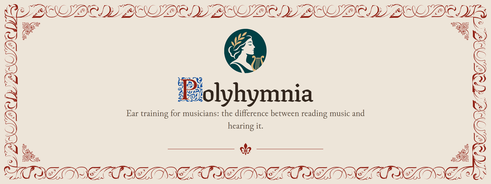

<p align="center">
  <picture>
    <source media="(prefers-color-scheme: dark)" srcset="docs/readme/banner-dark.png">
    
  </picture>
</p>

<p align="center">
  <a href="https://github.com/adrian729/app/actions/workflows/pages.yml"></a>
  
</p>

<p align="center">
  <a href="https://adrian729.github.io/app/"><b>Open the app</b></a>
</p>

Polyhymnia trains the part of musicianship that reading notation alone does not: hearing what is written. Short exercises play real scores and ask you to name, place or correct what you heard — no abstract interval buttons, no MIDI. Notation, theory and sound come from the [`@polyhymnia/*` packages](https://github.com/adrian729/notation).

## Exercises

Four exercises ship today, in recommended order:

| Folio | Exercise | What it trains |
|:--:|---|---|
| 01 | **Interval Comparison** | Hear two intervals and say which is wider, or whether they match. No note names, nothing to read. |
| 02 | **Interval Identification** | Hear one interval and name it, from perfect 4ths and 5ths up to compound intervals. |
| 03 | **Multi-Note Interval Identification** | Hear a stack of three to five notes and name every note's interval above the lowest. |
| 04 | **Chord Identification** | Hear one chord and name its quality, from major and minor up to seventh chords. |

Each has lesson and custom modes, and the app is entirely client-side. Specs live in [`docs/exercises/`](docs/exercises/); product research in [`docs/`](docs/).

## Development

Vite, React 19, TypeScript, Tailwind CSS v4, shadcn/ui and TanStack Router.

```sh
pnpm install
pnpm dev
pnpm typecheck
pnpm test
pnpm build
```

To develop against local checkouts of the packages, clone `notation`, `music-theory` and `web-audio` next to this repo (or set `POLYHYMNIA_SRC` to their parent directory) and run `pnpm dev:link`; `pnpm dev:unlink` returns to the npm versions.

## License

[MIT](LICENSE) © 2026 Adrián Sánchez Albanell. Bundled fonts, samples and ornaments keep their own licences — see the OFL and CREDITS files beside them.
